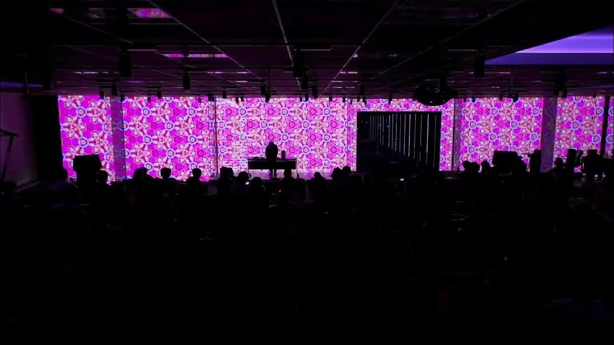

# Hyper Geek #5
 Audio Visual Live coding performance at Hyper Geek #5.

In order for the TidalCycles examples to play correctly, you will need to add audio samples and SuperCollider instruments from the following repository.

- [samples-extra](https://github.com/tado/samples-extra) : Extra audio samples for SuperDirt
- [synth-extra](https://github.com/tado/synth-extra) : Extra super collider instrument definitions

## License

This work is licensed under a
[Creative Commons Attribution-ShareAlike 4.0 International License][cc-by-sa].

[![CC BY-SA 4.0][cc-by-sa-image]][cc-by-sa]

[cc-by-sa]: http://creativecommons.org/licenses/by-sa/4.0/
[cc-by-sa-image]: https://licensebuttons.net/l/by-sa/4.0/88x31.png
[cc-by-sa-shield]: https://img.shields.io/badge/License-CC%20BY--SA%204.0-lightgrey.svg

